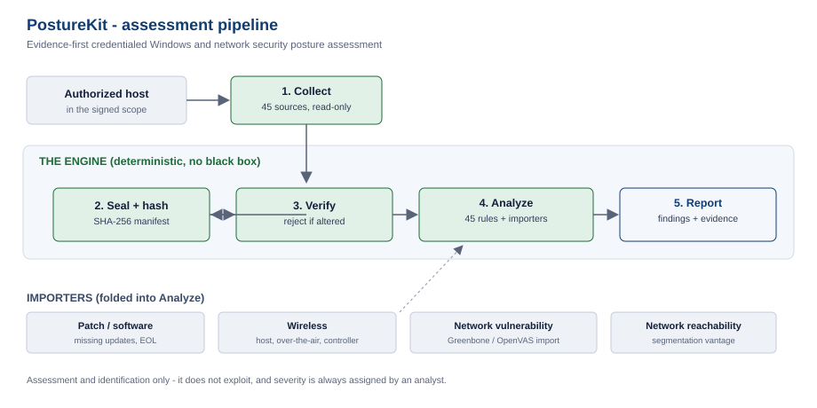

# PostureKit


**Evidence-first, credentialed Windows and network security posture assessment.**

PostureKit reads a fixed set of security-relevant facts from authorized Windows hosts, seals that
evidence so it cannot be tampered with, and evaluates it against a transparent rule set. It also folds
in adjacent planes - patch state, wireless configuration, and network vulnerability scans - through
importers. It identifies and reports; it does not exploit, and it never assigns severity on its own.



---

## Why it exists

Most host checks are either an opaque scanner you have to trust, or a pile of one-off scripts with no
evidence trail. PostureKit is deliberately the opposite:

- **Deterministic, no black box.** Every result comes from a named check against a value the tool read
  from the host. There is no machine-learning guess in the evidence path.
- **Tamper-evident evidence.** Every collection is sealed with a SHA-256 manifest. If a file is altered,
  verification fails and the analyzer refuses it.
- **Honest by design.** A check that cannot be completed is recorded as inconclusive, never as secure.
  Severity is always left to an analyst. The tool distinguishes what was *observed* from what is
  *inferred*.
- **No paid dependencies.** Patch data comes from Microsoft's free feed and the CISA known-exploited
  list; network scanning uses the free Greenbone/OpenVAS. No commercial scanner licence is required.

## What it covers

| Plane | What it assesses |
|---|---|
| **Windows host configuration** | Firewall, SMB, RDP, UAC, LSA and credential-protection settings, listening services and connections, installed software and updates, account and audit policy, and more (45 evidence sources). |
| **Active Directory** | Domain policy, privileged groups, trusts, Kerberos policy, applied GPOs and directory identity - collected automatically when the host is domain-joined. |
| **Wireless** | Host-side 802.11 configuration (saved networks, encryption, cipher, auto-join, 802.1X server-certificate validation, PMF, pre-shared-key exposure), plus importers for over-the-air captures and wireless-controller configuration. |
| **Patch state** | Missing Microsoft updates with vendor CVSS scores, from an offline catalog and Microsoft's free feed. |
| **Network** | Reachability and segmentation checks between vantage points, and import of Greenbone/OpenVAS vulnerability reports. |

## How it works

1. **Collect** - `Code/Run.ps1` launches `Code/Collect.ps1` against a host named in your scope. It reads
   a fixed set of facts read-only and writes them as a sealed, hashed evidence batch.
2. **Seal and verify** - each batch carries a `Manifest.txt` of SHA-256 hashes. `Code/VerifyManifest.py`
   confirms nothing changed.
3. **Analyze** - `Code/Analyze.py` evaluates a batch against `Code/Rules.json` and writes a normalized
   evidence set (`Evidence.json`, `Tests.csv`, `Summary.html`). Importers in `Extensions/` add the other
   planes.

Every result carries the control it relates to (NIST SP 800-53 references), the evidence pointer and its
hash, the method, and the outcome.

## Requirements

- **Windows PowerShell 5.1** on the machine you collect from (the collector is PowerShell).
- **Python 3.10+** on the machine you analyze from (standard library only - no third-party packages).

## Quick start

```powershell
# 1. Describe the target(s) in a scope file (see Code/ScopeWorkgroup.example.json).
# 2. Collect locally on the host:
powershell -ExecutionPolicy Bypass -File Code\Run.ps1 -ScopePath scope.json -Mode Local -AssetId HOST01 -AuthorizedLabRun
```

```bash
# 3. Analyze the sealed batch (off the host):
python Code/Analyze.py --batch Evidence/Raw/<batch-id> --output Reports/HOST01

# Optional: fold in other planes
python Code/Analyze.py --batch Evidence/Raw/<batch-id> \
  --greenbone gvm.json --wireless-controller controller.json --output Reports/HOST01
```

Verify a batch at any time:

```bash
python Code/VerifyManifest.py Evidence/Raw/<batch-id>
```

## Project layout

```
Code/          collector (Run.ps1, Collect.ps1, Common.ps1), analyzer (Analyze.py),
               rule set (Rules.json), scope examples, manifest verifier, test suite
Extensions/    importers and their runbooks - patch, wireless, network scan, software, findings draft
Templates/     blank intake templates for an engagement
docs/          architecture diagram
```

## Extending it

The analyzer takes external inputs the same way for every plane: an importer normalizes a tool's output
into an evidence document, and `Analyze.py` folds it in through a flag (`--greenbone`, `--wireless-air`,
`--wireless-controller`, `--nmap`, `--hardeningkitty`, `--cim`). The existing importers in `Extensions/`
are the pattern to copy for a new one.

## Scope - what it does *not* do

- It does **not** exploit, pivot, or prove exploitability. It identifies and evidences configuration and
  patch weaknesses.
- It does **not** discover hosts. It only touches machines named in the scope.
- A network scanner detects exposure, not confirmed exploitability, so scan results are treated as
  candidates an analyst confirms.

## Testing

```bash
python Code/Tests.py
```

The suite runs on synthetic data only - no PowerShell is executed and no host is contacted.

## Contributing

Issues and pull requests are welcome - new rule packs, additional importers, and coverage for more
Windows versions are all good first contributions. Open an issue to discuss anything larger.

If PostureKit is useful to you, a ⭐ helps others find it.

## License

Released under the [MIT License](LICENSE).
