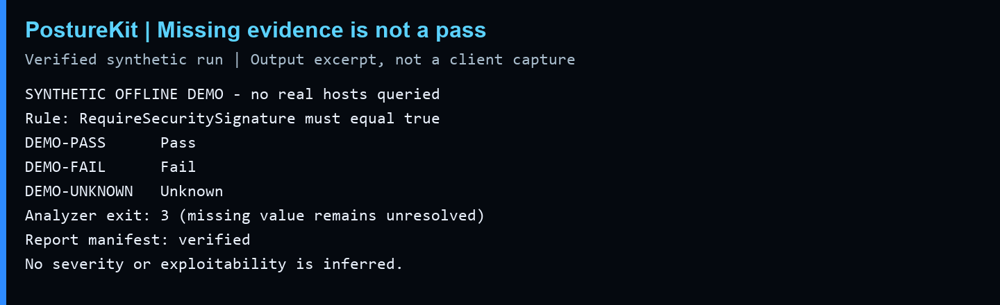

# See PostureKit distinguish failure from missing evidence

**Problem:** an unset or missing observation must not become a passing security check.

**Run:** `python examples/offline_demo.py` (Python 3.10+, standard library only).

**Result:** the real analyzer evaluates three fictional hosts against one illustrative SMB-signing rule. A true value passes, false fails, and a missing value stays Unknown. It writes its normal HTML, JSON and CSV outputs, and verifies the report manifest. The demo script exits successfully only when those expectations hold.

The image is typeset from a verified run transcript, not a screenshot of a real assessment. The last two local output paths are omitted. To choose a destination, use `python examples/offline_demo.py --output demo-run`; it refuses an existing destination. Otherwise a new temporary-directory path is printed and retained for inspection.

Open the printed `Summary.html` in a browser. The analyzer's exit code 3 is expected because one observation is unresolved; the wrapper checks that code. The fixture's zero collector hash and fixed timestamps are placeholders, not evidence of collection. It uses a one-rule demo profile, not the full production ruleset. No PowerShell, network scan or real-host collection runs.

**Interpretation:** a configuration mismatch is not itself proof of exploitation. An unknown result needs better evidence, not a guessed score. Hash verification detects changes relative to a trusted manifest; it does not establish authenticity if someone can replace both.
